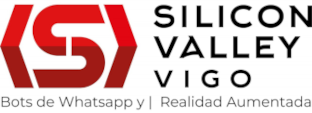

<h1 align="center">
    
</h1>
 

  <h2>
    💼 Formación laboral
  </h2>
    
  
Actualmente en búsqueda activa de empleo

  
Con muchas ganas de incorporarme a un equipo de trabajo y comenzar a rodar en el sector.

  

  
Hice las prácticas de empresa en:

  
  

<h2>
 📚 Educación
</h2>
 

  Técnico Superior en Desarrollo de Aplicaciones Multiplataforma.
   
 📌 CEBEM CPR CEBEM, 2022-2024
   
  

  <h2>Sobre mí</h2>
  
  
🧠 Actualmente trabajando con PHP a través de Laravel.

  
💻 Gran interés en aprender y desarrollarme en múltiples aspectos de la tecnología, pero mi preferencia se centra en el desarrollo backend.

  
👨‍🍳 Considero que una de las cosas más importantes en un trabajo es construir un buen ambiente laboral y saber trabajar en equipo.

 

<h2>
  💻 Herramientas y lenguajes
</h2>
 

  
  
   

   
  
     

